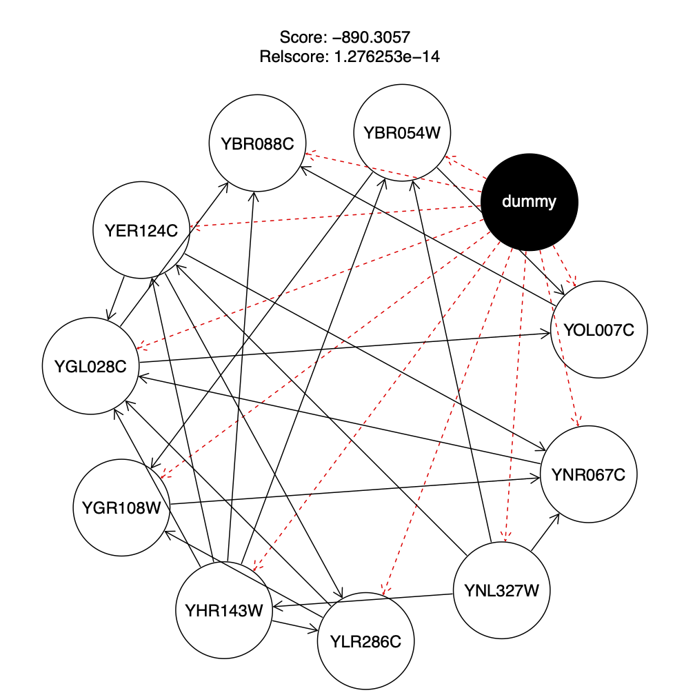

# SAD2_BayesianNetworks
Creating and analyzing bayesian networks from genes expression data

# Report

Report from project is available [here](docs/Report.pdf).

<html>
<body>
    

        <h4>BN* from report</h4>
        

    

</body>
</html>
